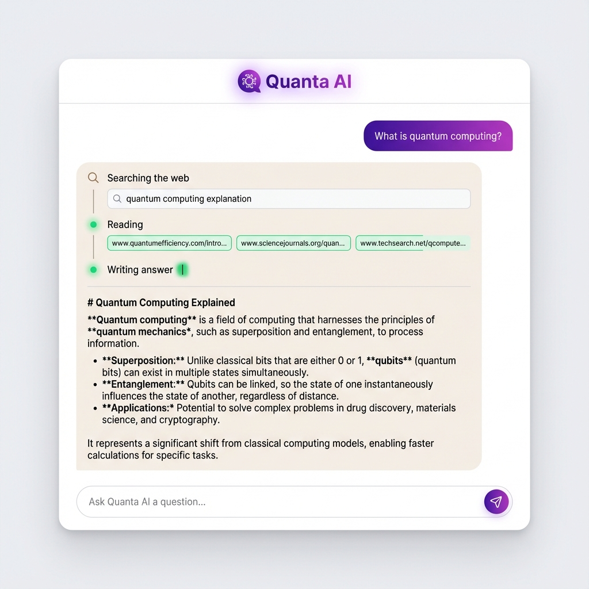
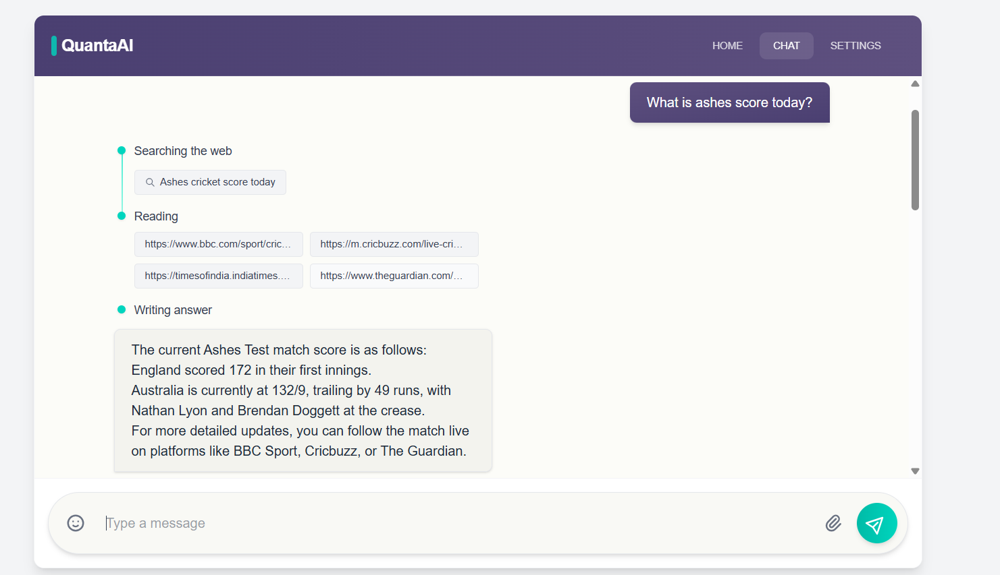
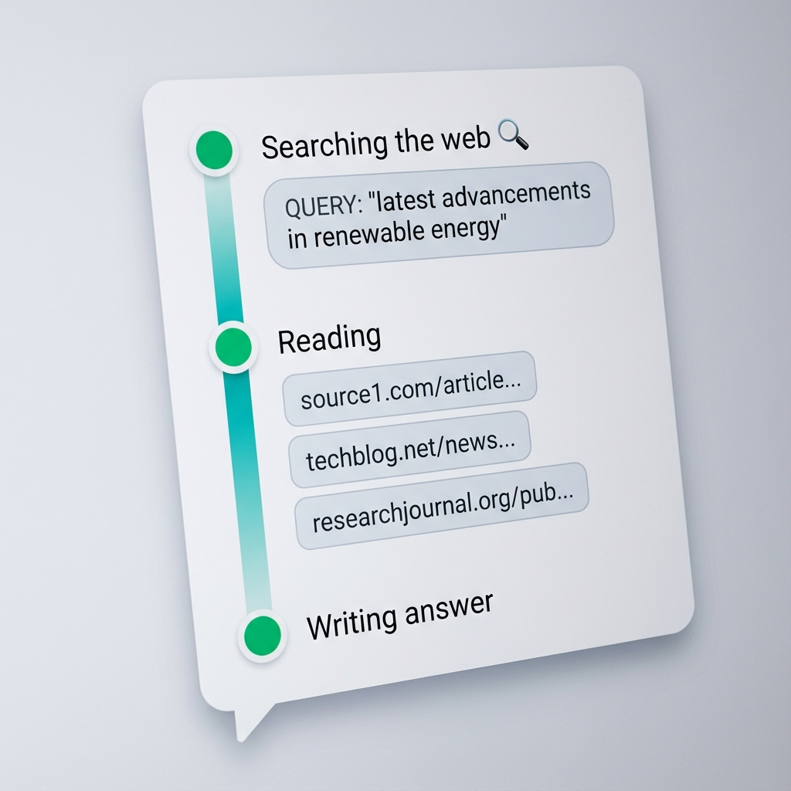
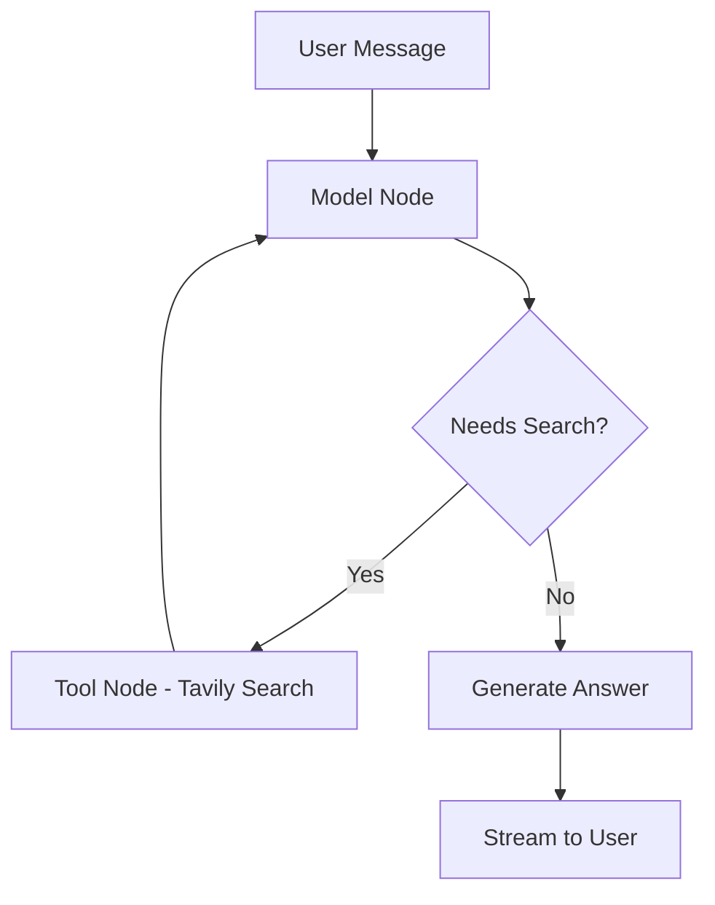
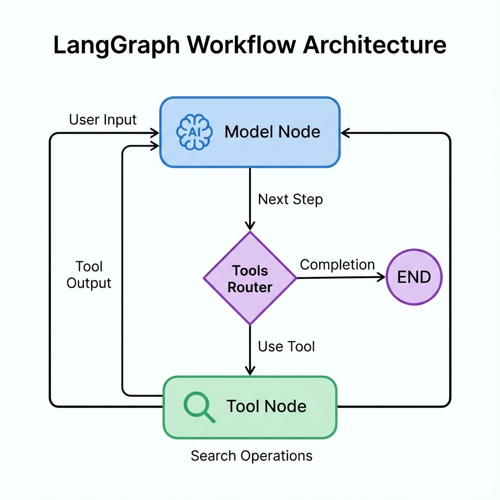

# Quanta AI

<div align="center">


**An intelligent AI-powered search assistant with real-time web search capabilities**

[](https://fastapi.tiangolo.com/)
[](https://nextjs.org/)
[](https://langchain-ai.github.io/langgraph/)
[](https://www.typescriptlang.org/)
[](https://www.python.org/)

</div>

---

## Table of Contents

- [Overview](#overview)
- [Features](#features)
- [Tech Stack](#tech-stack)
- [Architecture](#architecture)
- [How LangGraph Powers the AI](#how-langgraph-powers-the-ai)
- [Installation](#installation)
- [Configuration](#configuration)
- [Usage](#usage)
- [Example Q&A Sessions](#example-qa-sessions)
- [Project Structure](#project-structure)
- [Troubleshooting](#troubleshooting)
- [Future Roadmap](#future-roadmap)
- [Contributing](#contributing)
- [License](#license)
- [Acknowledgments](#acknowledgments)

---

## Overview

**Quanta AI** is a modern, intelligent conversational AI assistant that combines the power of GPT-4 with real-time web search capabilities. Built using **LangGraph** for sophisticated agentic workflows, it can autonomously search the web, read content from multiple sources, and provide well-informed answers with full transparency about its search process.

### What Makes Quanta AI Special

**Real-time Web Search Integration**: Automatically searches the web when needed using the Tavily Search API, ensuring responses are based on current, accurate information.

**Agentic AI Architecture**: Powered by LangGraph, the system creates intelligent decision-making workflows that determine when to search, what information to gather, and how to synthesize responses.

**Streaming Responses with Transparency**: Server-Sent Events (SSE) enable real-time streaming of AI reasoning, allowing users to see the search process unfold as it happens.

**Modern User Interface**: A responsive, professionally designed interface with gradient message bubbles, search stage visualization, and markdown rendering for rich content display.

**Conversation Memory**: Maintains context across multiple messages using LangGraph checkpointing, enabling natural, contextual conversations.

### Application Interface

<div align="center">



*Modern chat interface with real-time search visualization and responsive design*

</div>

<div align="center">



*Clean, professional interface with gradient message bubbles and markdown support*

</div>

---

## Features

### Current Capabilities

**Intelligent Search Detection**
- Autonomous determination of when web search is required
- GPT-4 powered decision-making to optimize between direct responses and web-augmented answers
- Context-aware routing for efficient information retrieval

**Visual Search Process Transparency**
- Real-time visualization of search stages (Searching, Reading, Writing)
- Display of actual search queries being executed
- Lists of URLs being processed and analyzed
- Clear progress indicators at each stage

<div align="center">



*Real-time visualization of AI search process with clear stage indicators and detailed information*

</div>

**Streaming AI Responses**
- Token-by-token streaming for instant user feedback
- Smooth typing animation during response generation
- Non-blocking UI for optimal user experience

**Conversation Persistence and Context**
- Maintains conversation context across multiple messages
- LangGraph checkpointing for reliable state management
- Thread-based conversation tracking

**Rich Content Rendering**
- Full markdown support with GitHub Flavored Markdown (GFM)
- Code syntax highlighting
- Lists, tables, and formatted text
- Responsive message layout

**Modern User Experience**
- Gradient-based message bubbles distinguishing user and AI messages
- Fully responsive design for desktop and mobile
- Clean, professional interface with intuitive controls
- Accessibility-focused component design

---

## Tech Stack

### Frontend (CLIENT)

**Framework**: Next.js 15.3 with React 19
- Industry-leading React framework for production-grade applications
- Server-side rendering (SSR) and static site generation (SSG) capabilities
- Optimized performance with automatic code splitting

**Language**: TypeScript 5
- Type-safe development with strict typing
- Enhanced IDE support and autocompletion
- Reduced runtime errors through compile-time checking

**Styling**: TailwindCSS 4
- Utility-first CSS framework
- Responsive design utilities
- Custom gradient configurations

**Markdown Rendering**: react-markdown with remark-gfm
- GitHub Flavored Markdown support
- Extensible plugin architecture
- Safe HTML rendering

**HTTP Communication**: EventSource API
- Native browser support for Server-Sent Events
- Automatic reconnection handling
- Unidirectional streaming from server to client

### Backend (SERVER)

**Framework**: FastAPI
- High-performance Python web framework
- Automatic OpenAPI documentation
- Type hints and validation with Pydantic
- Native async/await support

**AI Framework**: LangGraph + LangChain
- Stateful, agentic application development
- Cyclical graph-based workflows
- Tool integration and routing
- Memory management with checkpointing

**Large Language Model**: OpenAI GPT-4o
- Advanced reasoning capabilities
- Tool calling support
- Function calling for structured outputs

**Search Tool**: Tavily Search API
- AI-optimized search engine
- Real-time web information retrieval
- Clean, structured search results

**Streaming Protocol**: Server-Sent Events (SSE)
- HTTP-based streaming
- Status 200 persistent connections
- Event-driven architecture

**Memory Management**: LangGraph MemorySaver
- Persistent conversation state
- Thread-based checkpoint storage
- Automatic state serialization

---

## Architecture

### System Overview

```
┌──────────────────────┐         ┌───────────────────────┐
│   Next.js Frontend   │  HTTP   │   FastAPI Backend     │
│   (Port 3000)        │ ◄─────► │   (Port 8000)         │
└──────────────────────┘   SSE   └───────────────────────┘
                                            │
                                            ▼
                                  ┌───────────────────────┐
                                  │   LangGraph Engine    │
                                  │   State Machine       │
                                  └───────────────────────┘
                                            │
                              ┌─────────────┴──────────────┐
                              ▼                            ▼
                    ┌──────────────────┐        ┌──────────────────┐
                    │   OpenAI GPT-4   │        │  Tavily Search   │
                    │   LLM Service    │        │  Web API         │
                    └──────────────────┘        └──────────────────┘
```

### Component Interaction Flow

**1. User Input Capture**
The frontend React application captures user input through the InputBar component and adds the message to the conversation state.

**2. EventSource Connection Establishment**
An EventSource connection is opened to the FastAPI backend's `/chat_stream` endpoint with the user's message and conversation thread ID.

**3. LangGraph State Machine Processing**
The backend LangGraph state machine receives the input and begins processing:
- Analyzes the user's question
- Determines if web search is required
- Routes to appropriate nodes based on decision

**4. Tool Execution (Conditional)**
If web search is needed, the Tool Node executes:
- Formulates optimized search query
- Calls Tavily Search API
- Retrieves and processes results
- Returns structured data to Model Node

**5. AI Response Generation**
GPT-4 processes available information:
- Synthesizes search results (if applicable)
- Generates comprehensive, contextual answer
- Streams tokens in real-time

**6. Streaming Output Delivery**
Response tokens are streamed via SSE:
- Each token immediately sent to frontend
- Search stage updates broadcast in real-time
- Client updates UI progressively

**7. State Persistence**
Conversation state is saved:
- LangGraph checkpointing stores full context
- Thread ID maintains conversation continuity
- Memory persists across requests

---

## How LangGraph Powers the AI

### Understanding LangGraph

**LangGraph** is a framework designed for building stateful, multi-actor applications with Large Language Models. It extends LangChain's capabilities by introducing:

- **Stateful Computation Graphs**: Maintain state across multiple steps and interactions
- **Cyclical Workflows**: Enable loops and conditional branching unlike traditional linear pipelines
- **Agent Autonomy**: Allow AI to make decisions about tool usage and workflow paths
- **Memory Persistence**: Save and restore conversation state through checkpointing

### The Quanta AI Graph Architecture

Quanta AI implements a sophisticated LangGraph architecture that creates an intelligent agent capable of autonomous decision-making:

```python
# Graph Structure
graph_builder = StateGraph(State)
graph_builder.add_node("model", model)           # GPT-4 decision maker
graph_builder.add_node("tool_node", tool_node)   # Search executor
graph_builder.set_entry_point("model")

# Conditional routing based on LLM decision
graph_builder.add_conditional_edges("model", tools_router)
graph_builder.add_edge("tool_node", "model")
```

### Workflow Execution



<div align="center">



*Visual representation of the LangGraph workflow powering Quanta AI's intelligent search capabilities*

</div>

#### Node Descriptions

**1. Model Node (GPT-4 Decision Maker)**
- **Input**: User message and conversation history
- **Process**: 
  - Analyzes query intent and complexity
  - Determines information requirements
  - Decides whether current knowledge is sufficient or web search is needed
- **Output**: Either a direct response or a tool call request

**2. Tools Router (Conditional Edge)**
- **Function**: Examines Model Node output
- **Decision Logic**:
  - If tool calls are present → Route to Tool Node
  - If no tool calls (final answer ready) → Route to END
- **Purpose**: Enables dynamic workflow based on LLM decisions

**3. Tool Node (Search Executor)**
- **Input**: Tool call specifications from Model Node
- **Actions**:
  - Executes Tavily web search with optimized queries
  - Retrieves current, relevant information
  - Formats results for LLM consumption
- **Output**: Structured search results as tool messages
- **Flow**: Always returns to Model Node for synthesis

**4. Cyclical Processing Loop**
The graph supports multiple iterations:
```
User Query → Model (needs info) → Search → Model (synthesize) → Answer
```
This enables complex research workflows where multiple searches may be performed before generating the final response.

### Key LangGraph Features Implemented

#### State Management
```python
class State(TypedDict):
    messages: Annotated[list, add_messages]
```
**Purpose**: Maintains complete conversation history
**Benefit**: Automatic message appending and deduplication
**Implementation**: Type-safe state definition with annotations

#### Checkpointing and Memory
```python
memory = MemorySaver()
graph = graph_builder.compile(checkpointer=memory)
```
**Purpose**: Persist conversation state across requests
**Benefit**: Contextual conversations spanning multiple interactions
**Storage**: In-memory checkpointing with thread-based organization

#### Event Streaming
```python
events = graph.astream_events(
    {"messages": [HumanMessage(content=message)]},
    version="v2",
    config=config
)
```
**Purpose**: Real-time event broadcasting during execution
**Events Captured**:
- Model reasoning steps
- Tool execution details
- Search queries and results
- Token-level response generation
**Benefit**: Complete transparency into AI decision-making process

### Why This Architecture Matters

**Traditional LLM Applications**: Stateless, single-turn interactions with predetermined workflows.

**LangGraph-Powered Applications**: Stateful, multi-turn conversations with dynamic, AI-driven workflow routing.

This architecture enables Quanta AI to:
- Autonomously decide when information gathering is necessary
- Execute complex multi-step research processes
- Maintain context across extended conversations
- Provide transparency into its reasoning and actions

---

## Installation

### Prerequisites

**Required Software**:
- Node.js (version 18.0.0 or higher)
- Python (version 3.9 or higher)
- npm or yarn package manager
- Git for version control

**Required API Keys**:
- OpenAI API Key ([Get one here](https://platform.openai.com/api-keys))
- Tavily API Key ([Get one here](https://tavily.com/))

### Installation Steps

#### Step 1: Clone the Repository

```bash
git clone https://github.com/HarshTomar1234/QuantaAI.git
cd QuantaAI
```

#### Step 2: Backend Setup

Navigate to the server directory and set up the Python environment:

```bash
# Navigate to server directory
cd SERVER

# Create virtual environment
python -m venv venv

# Activate virtual environment
# Windows:
venv\Scripts\activate
# macOS/Linux:
source venv/bin/activate

# Install Python dependencies
pip install -r requirements.txt
```

**Dependencies installed include**:
- `fastapi`: Web framework
- `uvicorn`: ASGI server
- `langchain`: LLM framework
- `langgraph`: Stateful agent framework
- `langchain-openai`: OpenAI integration
- `langchain-community`: Community tools
- `python-dotenv`: Environment variable management

#### Step 3: Frontend Setup

Navigate to the client directory and install Node.js dependencies:

```bash
# Navigate to client directory (from project root)
cd CLIENT

# Install dependencies
npm install
```

**Dependencies installed include**:
- `next`: Next.js framework
- `react`: UI library
- `typescript`: Type checking
- `tailwindcss`: Styling framework
- `react-markdown`: Markdown rendering
- `remark-gfm`: GitHub Flavored Markdown support

#### Step 4: Environment Configuration

Create a `.env` file in the `SERVER` directory:

```bash
# In SERVER directory
touch .env  # macOS/Linux
# or
type nul > .env  # Windows
```

Add your API keys to the `.env` file:

```env
OPENAI_API_KEY=your_openai_api_key_here
TAVILY_API_KEY=your_tavily_api_key_here
```

**Security Note**: Never commit the `.env` file to version control. It is already included in `.gitignore`.

For reference, a `.env.example` file is provided:

```env
OPENAI_API_KEY=sk-...
TAVILY_API_KEY=tvly-...
```

---

## Configuration

### Backend Configuration

The FastAPI server can be configured in `SERVER/app.py`:

**CORS Settings**:
```python
app.add_middleware(
    CORSMiddleware,
    allow_origins=["http://localhost:3000"],  # Add production URLs here
    allow_credentials=True,
    allow_methods=["*"],
    allow_headers=["*"],
)
```

**Model Selection**:
```python
llm = ChatOpenAI(model="gpt-4o", streaming=True)
```
Modify the model parameter to use different OpenAI models (e.g., `gpt-4`, `gpt-3.5-turbo`).

**Search Tool Configuration**:
```python
search = TavilySearchResults(max_results=3)
```
Adjust `max_results` to change the number of search results processed.

### Frontend Configuration

The API endpoint is configured in `CLIENT/src/app/page.tsx`:

```typescript
const eventSource = new EventSource(
    `http://127.0.0.1:8000/chat_stream?message=${encodeURIComponent(userMessage)}&thread_id=${threadId}`
);
```

For production deployment, update this URL to your deployed backend endpoint.

---

## Usage

### Starting the Application

Open two terminal windows:

**Terminal 1 - Backend Server**:
```bash
cd SERVER
uvicorn app:app --reload
```

Expected output:
```
INFO:     Uvicorn running on http://127.0.0.1:8000 (Press CTRL+C to quit)
INFO:     Started reloader process
INFO:     Started server process
INFO:     Waiting for application startup.
INFO:     Application startup complete.
```

**Terminal 2 - Frontend Development Server**:
```bash
cd CLIENT
npm run dev
```

Expected output:
```
   ▲ Next.js 15.3.0
   - Local:        http://localhost:3000
   - Ready in 2.3s
```

**Access the Application**:
Open your browser and navigate to:
```
http://localhost:3000
```

### Basic Interaction

**Asking Questions**:
1. Type your question in the input field at the bottom of the screen
2. Press Enter or click the send button
3. Watch the AI process your question in real-time

**Example Queries**:

Direct Knowledge Questions (No Search):
```
- "Explain how neural networks work"
- "What is the difference between supervised and unsupervised learning?"
- "How does gradient descent optimize model parameters?"
```

Search-Enhanced Queries (Automatic Web Search):
```
- "What are the latest developments in quantum computing?"
- "What is the current weather in New York?"
- "What happened in the news today about space exploration?"
```

### Understanding Search Visualization

When the AI determines a search is needed, you will see:

**Stage 1: Searching**
```
Searching the web
└─ quantum computing breakthroughs 2024
```

**Stage 2: Reading**
```
Reading
└─ nature.com/quantum-advances
└─ mit.edu/quantum-news
└─ quantumtech.com/latest
```

**Stage 3: Writing**
```
Writing answer
```

The AI response will stream in real-time after the search completes.

---

## Example Q&A Sessions

### Example 1: General Knowledge Query

**User Question**: "Explain the concept of neural networks in simple terms."

**AI Response**:

Neural networks are computational models inspired by the human brain's structure and function. They consist of interconnected processing units called neurons organized in layers.

**Architecture Components**:

**Input Layer**: Receives raw data such as pixel values from an image or numerical features from a dataset.

**Hidden Layers**: Process and transform the input data through weighted connections and activation functions. Deep networks may have many hidden layers, hence "deep learning."

**Output Layer**: Produces the final prediction, such as a classification label or continuous value.

**Learning Process**:

1. **Forward Propagation**: Input data flows through the network, producing an output.
2. **Loss Calculation**: The difference between predicted and actual outputs is measured.
3. **Backpropagation**: The error is propagated backward through the network.
4. **Weight Updates**: Connection strengths are adjusted using optimization algorithms like gradient descent.
5. **Iteration**: The process repeats until the network achieves acceptable accuracy.

**Applications**:
- Image recognition and computer vision
- Natural language processing and translation
- Speech recognition
- Recommendation systems
- Autonomous vehicles

**Note**: This answer was generated directly from the model's training data without web search.

---

### Example 2: Current Events Query (With Search)

**User Question**: "What is the latest news about SpaceX Starship?"

**Search Process**:

```
Searching the web
└─ SpaceX Starship latest news 2024

Reading
└─ spacex.com/starship
└─ nasa.gov/spacex-updates
└─ spaceflightnow.com/starship

Writing answer
```

**AI Response**:

Based on recent developments, SpaceX continues to make significant progress with the Starship program:

**Recent Test Flights**:
- Successfully completed the fifth integrated test flight with the first-ever booster catch using the launch tower's "chopstick" arms
- Achieved controlled ocean splashdown of the Starship upper stage
- Demonstrated heat shield improvements with better tile retention

**Regulatory Milestones**:
- Received FAA approval for increased launch frequency from Starbase, Texas
- Environmental assessments progressing for expanded operations
- License modifications granted for catch-and-reuse operations

**NASA Partnership**:
- Artemis III lunar lander variant development ongoing
- Human Landing System contract milestones being met
- In-orbit refueling demonstration planned for 2025

**Future Plans**:
- Targeting orbital refueling tests to enable deep space missions
- Commercial payload missions scheduled for late 2025
- Continued iteration on rapid reusability

**Implications**:
The Starship program represents a paradigm shift in space transportation, with fully reusable heavy-lift capability aimed at reducing cost per kilogram to orbit by orders of magnitude. Success in these test campaigns brings Mars colonization and sustainable lunar presence closer to reality.

**Sources**: Information synthesized from spacex.com, nasa.gov, and spaceflightnow.com

---

### Example 3: Technical Deep Dive

**User Question**: "How does LangGraph enable agentic AI behavior in this application?"

**AI Response**:

LangGraph enables agentic AI behavior through several sophisticated mechanisms that transform traditional LLM applications into autonomous, intelligent agents:

**1. Stateful Computation Graphs**

Traditional Approach:
```
User Input → LLM → Output (stateless, no memory)
```

LangGraph Approach:
```python
class State(TypedDict):
    messages: Annotated[list, add_messages]
```
This maintains complete conversation history, allowing the agent to reference previous interactions and build contextual understanding.

**2. Conditional Routing and Decision Making**

The agent autonomously decides its workflow:

```python
graph_builder.add_conditional_edges("model", tools_router)
```

**Decision Tree**:
- Does this question require current information? → Search the web
- Is the information in my training data sufficient? → Answer directly
- Do I need to verify facts? → Perform additional searches

**3. Tool Integration with Autonomous Execution**

```python
tools = [TavilySearchResults(max_results=3)]
llm_with_tools = llm.bind_tools(tools)
```

The LLM can call tools on its own initiative rather than following predetermined paths. It formulates search queries, interprets results, and decides if additional searches are needed.

**4. Cyclical Workflows for Multi-Step Reasoning**

Unlike linear pipelines, LangGraph supports loops:

```
Question → Analyze → Search → Re-analyze with Results → 
Determine if More Info Needed → (Optional: Search Again) → Synthesize Answer
```

**5. Memory and Checkpointing**

```python
memory = MemorySaver()
graph = graph_builder.compile(checkpointer=memory)
```

**Benefits**:
- Conversations persist across sessions
- Context awareness for follow-up questions
- State recovery in case of failures
- Ability to pause and resume complex operations

**6. Event Streaming for Transparency**

```python
events = graph.astream_events(config=config)
```

Broadcasts every step of the agent's reasoning:
- Tool call decisions
- Search query formulation
- Result processing
- Response generation

**Practical Impact in Quanta AI**:

When you ask "What's new with SpaceX Starship?", the agent:

1. **Analyzes** the question and recognizes it requires current information
2. **Decides** to use the search tool (autonomous decision)
3. **Formulates** an optimized search query
4. **Executes** the Tavily search
5. **Processes** results from multiple sources
6. **Synthesizes** information into a coherent answer
7. **Streams** the response while maintaining conversation context

This multi-step, decision-driven workflow is impossible with traditional LLM API calls, which are stateless and single-turn. LangGraph transforms the LLM into an intelligent agent capable of planning, tool use, and adaptive reasoning.

**Architectural Advantage**:

Traditional architectures require developers to hardcode workflow logic. LangGraph delegates workflow decisions to the LLM itself, enabling emergent behaviors and adaptive problem-solving that improves with better underlying models.

---

## Project Structure

```
QuantaAI/
├── CLIENT/                              # Frontend Application (Next.js)
│   ├── src/
│   │   ├── app/
│   │   │   ├── favicon.ico             # Browser tab icon
│   │   │   ├── globals.css             # Global styles and Tailwind configuration
│   │   │   ├── layout.tsx              # Root layout with metadata and HTML structure
│   │   │   └── page.tsx                # Main chat page with state management logic
│   │   └── components/
│   │       ├── Header.tsx              # Top navigation bar component
│   │       ├── MessageArea.tsx         # Chat messages and search visualization
│   │       └── InputBar.tsx            # Message input component with send button
│   ├── public/                         # Static assets and icons
│   │   ├── file.svg
│   │   ├── globe.svg
│   │   ├── next.svg
│   │   ├── vercel.svg
│   │   └── window.svg
│   ├── .gitignore                      # Frontend Git ignore rules
│   ├── next.config.ts                  # Next.js configuration
│   ├── package.json                    # Frontend dependencies
│   ├── postcss.config.mjs              # PostCSS configuration for Tailwind
│   ├── tailwind.config.ts              # Tailwind CSS configuration
│   └── tsconfig.json                   # TypeScript configuration
│
├── SERVER/                              # Backend Application (FastAPI)
│   ├── app.py                          # Main application file
│   │   ├── State definition            # TypedDict for conversation state
│   │   ├── LangGraph setup             # Graph construction and compilation
│   │   ├── Model node                  # GPT-4 integration with tool binding
│   │   ├── Tool node                   # Tavily search execution
│   │   └── FastAPI endpoints           # /chat_stream SSE endpoint
│   ├── .env                            # Environment variables (not in git)
│   ├── .env.example                    # Example environment configuration
│   ├── .gitignore                      # Backend Git ignore rules
│   ├── requirements.txt                # Python dependencies
│   └── venv/                           # Virtual environment (not in git)
│
├── assets/                              # Documentation assets
│   └── images/
│       ├── app_interface.png           # Application interface screenshot
│       ├── chat_interface.png          # Chat interface screenshot
│       ├── langgraph_architecture.png  # LangGraph workflow diagram
│       └── search_stages.png           # Search stages visualization
│
├── .gitignore                          # Root Git ignore rules
├── notes.md                            # Development notes and SSL certificate fix
└── README.md                           # This file
```

### Key Files Explained

#### Frontend Files

**`CLIENT/src/app/page.tsx`**
- Main chat interface component
- State management for messages and conversation thread
- EventSource connection setup for SSE streaming
- Message handling and display logic
- Search stage state tracking and updates

**`CLIENT/src/components/MessageArea.tsx`**
- Renders conversation history with user and AI messages
- SearchStages subcomponent for search process visualization
- Markdown rendering with react-markdown and remark-gfm
- Responsive message bubble styling with gradients
- Auto-scroll to latest message

**`CLIENT/src/components/InputBar.tsx`**
- Message input field with controlled component pattern
- Submit button with gradient styling
- Form submission handling
- Attachment and emoji button placeholders

**`CLIENT/src/app/layout.tsx`**
- Root layout component wrapping all pages
- HTML document structure
- Metadata configuration (title, description)
- Font imports and global styles

**`CLIENT/src/app/globals.css`**
- Tailwind CSS directives and imports
- Custom CSS variables
- Global style overrides
- Utility class definitions

#### Backend Files

**`SERVER/app.py`**
- Complete backend implementation in a single file
- **State Definition**: TypedDict for LangGraph state management
- **Tool Configuration**: Tavily Search integration
- **Model Setup**: GPT-4o with tool binding
- **Graph Construction**: StateGraph with model and tool nodes
- **Router Logic**: Conditional edge for search decision
- **Memory Management**: MemorySaver checkpointing
- **FastAPI Setup**: CORS middleware configuration
- **SSE Endpoint**: `/chat_stream` for real-time streaming
- **Event Processing**: Filters and formats LangGraph events
- **Error Handling**: Robust error catching and logging

**`SERVER/requirements.txt`**
```
fastapi
uvicorn
langchain
langgraph
langchain-openai
langchain-community
python-dotenv
```

**`SERVER/.env.example`**
Template for required environment variables with placeholder values.

---

## Troubleshooting

### Common Issues and Solutions

#### Issue 1: SSL Certificate Validation Errors

**Symptom**:
```
SSL: CERTIFICATE_VERIFY_FAILED
```

**Cause**: Python cannot locate or validate SSL certificates when making HTTPS requests to external APIs.

**Solution**:

On macOS:
```bash
pip install certifi
/Applications/Python\ 3.9/Install\ Certificates.command
```

On Windows:
```bash
pip install --upgrade certifi
```

On Linux:
```bash
pip install --upgrade certifi
sudo update-ca-certificates
```

#### Issue 2: CORS Errors in Browser Console

**Symptom**:
```
Access to fetch at 'http://127.0.0.1:8000/chat_stream' from origin 'http://localhost:3000' 
has been blocked by CORS policy
```

**Cause**: CORS middleware not properly configured or backend not running.

**Solution**:
1. Ensure backend server is running on port 8000
2. Verify CORS configuration in `SERVER/app.py`:
```python
allow_origins=["http://localhost:3000"]
```
3. Add your production URL to allowed origins when deploying

#### Issue 3: API Key Errors

**Symptom**:
```
AuthenticationError: No API key provided
```

**Cause**: Environment variables not loaded or incorrect key format.

**Solution**:
1. Verify `.env` file exists in `SERVER/` directory
2. Check key format:
```env
OPENAI_API_KEY=sk-...
TAVILY_API_KEY=tvly-...
```
3. Ensure no extra quotes or spaces around keys
4. Restart the backend server after updating `.env`

#### Issue 4: EventSource Connection Fails

**Symptom**: No streaming response, connection immediately closes.

**Cause**: Backend error or endpoint not accessible.

**Solution**:
1. Check backend terminal for error messages
2. Verify endpoint URL in browser developer tools
3. Test endpoint directly:
```bash
curl http://127.0.0.1:8000/chat_stream?message=test&thread_id=1
```
4. Check firewall settings blocking port 8000

#### Issue 5: Module Import Errors

**Symptom**:
```
ModuleNotFoundError: No module named 'langchain'
```

**Cause**: Dependencies not installed or virtual environment not activated.

**Solution**:
```bash
# Activate virtual environment
cd SERVER
source venv/bin/activate  # macOS/Linux
venv\Scripts\activate     # Windows

# Reinstall dependencies
pip install -r requirements.txt
```

#### Issue 6: Port Already in Use

**Symptom**:
```
ERROR: [Errno 48] Address already in use
```

**Solution**:

Find and kill process using port 8000:
```bash
# macOS/Linux
lsof -ti:8000 | xargs kill -9

# Windows
netstat -ano | findstr :8000
taskkill /PID <PID> /F
```

Or use a different port:
```bash
uvicorn app:app --reload --port 8001
```
Update frontend URL accordingly.

---

## Future Roadmap

### Phase 1: Enhanced Intelligence

**Multi-Tool Support**
- Calculator for mathematical computations
- Weather API integration for location-based forecasts
- News API for categorized current events
- Wikipedia integration for encyclopedic knowledge

**Code Interpreter**
- Execute Python code in sandboxed environment
- Generate visualizations and charts
- Perform data analysis on uploaded datasets

**Source Citations and Verification**
- Direct links to exact source paragraphs
- Confidence scoring for each statement
- Primary vs secondary source identification
- Fact-checking across multiple sources

**Explainable AI**
- Detailed reasoning chain visualization
- Confidence levels for different parts of responses
- Alternative interpretation presentation
- Uncertainty quantification

### Phase 2: User Experience Enhancements

**Voice Interaction**
- Speech-to-text input using Web Speech API
- Text-to-speech output with natural voices
- Multi-language voice support
- Voice command shortcuts

**Theme Customization**
- Dark mode with OLED optimization
- Light mode refinements
- Custom color scheme creation
- Accessibility contrast presets

**Message Management**
- Edit previous messages and regenerate responses
- Delete individual messages
- Branch conversations at any point
- Star important messages for later reference

**Export and Sharing**
- Export conversations as PDF with formatting
- Markdown export for documentation
- Share conversations via unique URLs
- Embed conversations in web pages

**Mobile Application**
- Native iOS application
- Native Android application
- Progressive Web App (PWA) support
- Responsive design optimization

### Phase 3: Advanced Features

**Multi-Modal Support**
- Image upload and analysis
- Vision model integration (GPT-4 Vision)
- Image generation with DALL-E
- OCR for document scanning

**Document Intelligence**
- PDF upload and chat with documents
- Document summarization
- Key information extraction
- Multi-document comparison

**Agent Plugin System**
- Extensible tool marketplace
- Custom tool development framework
- Community-contributed plugins
- Plugin sandboxing and security

**Specialized Agents**
- Code assistant specialized for programming
- Research assistant for academic work
- Writing coach for content creation
- Data analyst for business intelligence

### Phase 4: Enterprise Features

**User Authentication and Authorization**
- Email/password authentication
- OAuth integration (Google, GitHub, Microsoft)
- Role-based access control
- Multi-factor authentication

**Rate Limiting and Quotas**
- Per-user API usage limits
- Tiered subscription plans
- Usage analytics dashboard
- Cost tracking and optimization

**Team Collaboration**
- Shared workspace for teams
- Collaborative conversations
- Permission management
- Activity logs and audit trails

**Administration Dashboard**
- User management interface
- System health monitoring
- Usage analytics and reporting
- Configuration management

**Deployment Options**
- Self-hosted installation package
- Docker containerization
- Kubernetes deployment manifests
- Cloud provider marketplace listings

### Phase 5: Research and Innovation

**Agent Swarms**
- Multiple specialized agents collaborating
- Agent-to-agent communication protocols
- Emergent problem-solving strategies
- Distributed task execution

**Reinforcement Learning from Human Feedback**
- Thumbs up/down feedback collection
- Response quality improvement over time
- Personalized model fine-tuning
- A/B testing for improvements

**Custom Model Fine-Tuning**
- Domain-specific knowledge injection
- Industry terminology adaptation
- Company-specific context understanding
- Continuous learning from interactions

**Advanced Reasoning**
- Multi-step logical reasoning
- Causal inference capabilities
- Counterfactual thinking
- Analogical reasoning

---

## Contributing

Contributions are welcome and greatly appreciated. This project benefits from community involvement in multiple areas.

### How to Contribute

#### 1. Fork and Clone

```bash
# Fork the repository on GitHub
# Clone your fork
git clone https://github.com/HarshTomar1234/QuantaAI.git
cd QuantaAI
```

#### 2. Create a Feature Branch

```bash
git checkout -b feature/your-feature-name
```

Branch naming conventions:
- `feature/` for new features
- `bugfix/` for bug fixes
- `docs/` for documentation updates
- `refactor/` for code refactoring

#### 3. Make Your Changes

Follow the coding standards:

**Frontend (TypeScript/React)**:
- Use TypeScript strict mode
- Follow React Hooks best practices
- Maintain component modularity
- Add PropTypes or TypeScript interfaces

**Backend (Python)**:
- Follow PEP 8 style guide
- Use type hints
- Add docstrings to functions
- Handle errors gracefully

#### 4. Test Your Changes

**Frontend Testing**:
```bash
cd CLIENT
npm run build  # Ensure build succeeds
npm run dev    # Test locally
```

**Backend Testing**:
```bash
cd SERVER
python -m pytest  # Run tests (when available)
uvicorn app:app --reload  # Manual testing
```

#### 5. Commit Your Changes

```bash
git add .
git commit -m "Add: descriptive commit message"
```

Commit message conventions:
- `Add:` for new features
- `Fix:` for bug fixes
- `Update:` for updates to existing features
- `Refactor:` for code refactoring
- `Docs:` for documentation changes

#### 6. Push and Create Pull Request

```bash
git push origin feature/your-feature-name
```

Open a Pull Request on GitHub with:
- Clear description of changes
- Screenshots for UI changes
- Testing performed
- Related issue numbers

### Areas for Contribution

**Frontend Development**
- UI/UX improvements and modern design patterns
- New components (code blocks, file upload, image display)
- Accessibility features (ARIA labels, keyboard navigation)
- Performance optimization (lazy loading, memoization)
- Responsive design enhancements

**Backend Development**
- Additional tool integrations (calculators, APIs)
- Performance optimization (caching, parallel processing)
- Error handling improvements
- Logging and monitoring enhancements
- Alternative LLM provider support

**LangGraph Workflows**
- New agent architectures
- Multi-agent collaboration
- Advanced reasoning patterns
- Tool chaining strategies

**Documentation**
- Tutorial content for beginners
- Architecture deep dives
- API documentation
- Video walkthroughs
- Use case examples

**Testing**
- Unit tests for components and functions
- Integration tests for API endpoints
- End-to-end testing with Playwright or Cypress
- Load testing for scalability

**DevOps**
- Docker containerization
- CI/CD pipeline setup
- Deployment documentation
- Infrastructure as Code (Terraform, CloudFormation)

### Code Review Process

All contributions go through code review:

1. Automated checks run (linting, build verification)
2. Maintainers review code for quality and design
3. Feedback provided for improvements
4. Approval and merge once standards are met

### Community Guidelines

- Be respectful and professional in all interactions
- Provide constructive feedback
- Help others learn and grow
- Follow the Code of Conduct

---

## License

This project is licensed under the **MIT License**.

**Permission is hereby granted**, free of charge, to any person obtaining a copy of this software and associated documentation files (the "Software"), to deal in the Software without restriction, including without limitation the rights to use, copy, modify, merge, publish, distribute, sublicense, and/or sell copies of the Software, and to permit persons to whom the Software is furnished to do so, subject to the following conditions:

The above copyright notice and this permission notice shall be included in all copies or substantial portions of the Software.

**THE SOFTWARE IS PROVIDED "AS IS"**, WITHOUT WARRANTY OF ANY KIND, EXPRESS OR IMPLIED, INCLUDING BUT NOT LIMITED TO THE WARRANTIES OF MERCHANTABILITY, FITNESS FOR A PARTICULAR PURPOSE AND NONINFRINGEMENT. IN NO EVENT SHALL THE AUTHORS OR COPYRIGHT HOLDERS BE LIABLE FOR ANY CLAIM, DAMAGES OR OTHER LIABILITY, WHETHER IN AN ACTION OF CONTRACT, TORT OR OTHERWISE, ARISING FROM, OUT OF OR IN CONNECTION WITH THE SOFTWARE OR THE USE OR OTHER DEALINGS IN THE SOFTWARE.

For the full license text, see the [LICENSE](LICENSE) file in the repository.

---

## Acknowledgments

This project builds upon excellent open-source technologies and frameworks:

**LangChain and LangGraph**
The LangChain team for creating the LangGraph framework that enables sophisticated agentic AI workflows. Their work has made stateful, intelligent agents accessible to developers.

**OpenAI**
For providing the GPT-4 API that powers the conversational capabilities and reasoning at the heart of Quanta AI.

**Tavily**
For the AI-optimized search API that enables real-time web information retrieval with clean, structured results.

**Vercel and the Next.js Team**
For the Next.js framework that provides an excellent developer experience and production-ready React applications.

**FastAPI Community**
For the high-performance, modern Python web framework with excellent documentation and developer ergonomics.

**Open Source Contributors**
All the developers who maintain the libraries and tools that make this project possible:
- React team for the UI library
- TypeScript team for type safety
- TailwindCSS team for utility-first styling
- react-markdown maintainers for markdown rendering
- uvicorn team for the ASGI server

---

## Contact and Support

### Getting Help

**GitHub Issues**
For bug reports and feature requests, please use [GitHub Issues](https://github.com/HarshTomar1234/QuantaAI/issues).

When opening an issue, please include:
- Clear description of the problem or request
- Steps to reproduce (for bugs)
- Expected vs actual behavior
- Environment details (OS, Python version, Node version)
- Relevant error messages or logs

**GitHub Discussions**
For questions, ideas, and community discussion, use [GitHub Discussions](https://github.com/HarshTomar1234/QuantaAI/discussions).

Discussion categories:
- Q&A for usage questions
- Ideas for feature proposals
- Show and Tell for sharing what you've built
- General for everything else

### Project Information

**Repository**: [github.com/HarshTomar1234/QuantaAI](https://github.com/HarshTomar1234/QuantaAI)

**Documentation**: This README and in-code documentation

**Latest Release**: Check the [Releases](https://github.com/HarshTomar1234/QuantaAI/releases) page

---

<div align="center">

**Built with LangGraph, FastAPI, and Next.js**

**Powered by OpenAI GPT-4 and Tavily Search**

</div>
